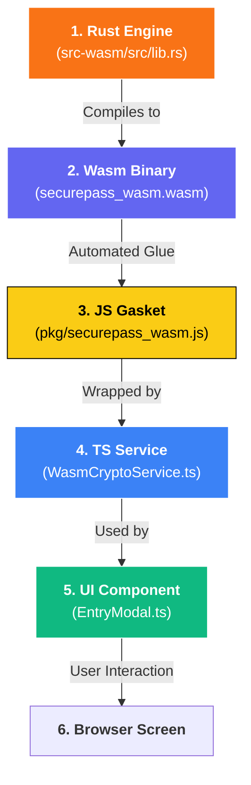

# SecurePass Developer Manual

**Version:** 1.0.0  
**Security Model:** Zero-Knowledge, Client-Side Only  
**Architecture:** Modern Web Components & Reactive State

---

SecurePass is built as a highly modular, static web application. It follows a **Logic-vs-Orchestration** hybrid model across two distinct runtime tiers.

### 1. The Logic Tier (`src-wasm/src/lib.rs`)
The "Trust Anchor" of SecurePass. Core cryptographic logic (Argon2id, AES-GCM) is written in Rust and compiled to WebAssembly. This ensures memory isolation and native performance.

#### 🦀 Function Breakdown (Novice Guide)

The Rust module exposes the `CryptoBridge` class to JavaScript. Here is how its core functions work:

| Function | Inputs | Outputs | Description |
| :--- | :--- | :--- | :--- |
| **`new`** (Constructor) | `password` (String), `salt` (Bytes) | `CryptoBridge` instance | Uses **Argon2id** to transform your master password into a 32-byte cryptographic key. This key is stored *only* inside the Wasm memory. |
| **`encrypt`** | `plaintext` (String), `iv` (12 Bytes) | `Vec<u8>` (Encrypted Ciphertext) | Uses **AES-256-GCM** to seal data. The `iv` (Initialization Vector) ensures that encrypting the same password twice results in different ciphertext. |
| **`decrypt`** | `ciphertext` (Bytes), `iv` (12 Bytes) | `Result<String>` (Decrypted Text) | The reverse of encrypt. If the key or data is tampered with, it returns a secure error instead of corrupt data. |
| **`generate_password`** | `options` (Complexity Settings) | `String` (Random Password) | Uses the hardware-level `rand` crate to generate high-entropy passwords based on user-defined length and character sets. |
| **`get_totp_code`** | `secret` (Base32 String) | `String` (6-digit Code) | Parses a 2FA secret and calculates the current time-based code using the industrial-standard TOTP algorithm. |
| **`rotate_history`** | `password` (String), `history_json` (String) | `String` (Updated History JSON) | Manages the "sliding window" of the last 5 passwords. It decodes the existing history, adds the new entry, and truncates the oldest. |
| **`derive_bio_key`** | `rawId` (Bytes) | `Vec<u8>` (Wrapping Key) | Derives a persistent wrapping key from a passkey credential using Argon2id. |
| **`wrap_password`** | `password` (String), `bioKey` (Bytes), `iv` | `Vec<u8>` (Encrypted Master) | Seals your master password for biometric unlock using AES-GCM. |
| **`unwrap_password`** | `wrappedData` (Bytes), `bioKey`, `iv` | `Result<String>` (Decrypted Master) | Unlocks the master password during biometric login. |

> [!NOTE]
> **Memory Security**: Every time the `CryptoBridge` is "dropped" (removed from memory), it automatically runs a **Zeroize** routine. This physically wipes the 32-byte master key from the computer's RAM, preventing "memory scraping" attacks.

---

## 🏗️ The Journey from Rust to TypeScript

Since you're new to Rust, think of it as the **Secure Engine** in the basement, while TypeScript is the **Control Panel** in the lobby. Here is how a single feature (like the Password Generator) travels from code to screen.

### 🗺️ Flow Diagram


### 🔍 Step-by-Step Example: `generate_password`

#### 1. The Rust Origin (`lib.rs`)
The "Source of Truth". We use a high-security library (`rand`) to generate randomness that the browser's JavaScript can't easily do.
```rust
#[wasm_bindgen]
pub fn generate_password(&self, options: JsValue) -> String {
    // 1. Convert JavaScript object to Rust struct
    let opts: PasswordOptions = serde_wasm_bindgen::from_value(options).unwrap();
    // 2. Perform heavy lifting
    self.generate_password_core(opts)
}
```

#### 2. The Wasm-Bindgen Magic
When we run `wasm-pack build`, a tool called `wasm-bindgen` looks for that `#[wasm_bindgen]` tag. It automatically creates the **JavaScript Glue** code that handles memory pointers, converting a "Rust String" into a "JavaScript String" so you don't have to worry about the binary details.

#### 3. The TypeScript Wrapper (`WasmCryptoService.ts`)
We wrap the raw Wasm call in a clean, static TypeScript method. This gives us **Auto-complete** and **Type Checking** in our IDE.
```typescript
static generatePassword(bridge: any, options: any): string {
    // Calling the Rust function that lives inside the Wasm module
    return wasm.generate_password(bridge, options);
}
```

#### 4. The UI Implementation (`EntryModal.ts`)
Finally, the component just calls our Service. It doesn't even know Rust exists!
```typescript
const newPwd = WasmCryptoService.generatePassword(bridge, options);
this.querySelector('#password-input').value = newPwd;
```

---
While the "How" of cryptography is in Rust, the "**When** and **Where**" is managed by TypeScript. 

TS responsibilities include:
- **State Management**: Reactive data updates using the `VaultState` singleton.
- **Persistence Orchestration**: Coordinating the flow of encrypted data to and from `localStorage`.
- **Hardware Integration**: Managing the WebAuthn flow for Biometrics.
- **Automation**: Handling the `AutoLockService` and inactivity timers.
- **Network Bridges**: Interfacing with external APIs (e.g., HaveIBeenPwned for Breach Checks).

```typescript
// Example: Orchestrating a save flow
const ciphertext = await wasmCrypto.encrypt(newData, iv); // Logic Tier (Rust)
storage.save('vault', ciphertext);                       // Orchestration Tier (TS)
```

### 2. Component Layer (`src/components/`)
UI is broken into reusable Custom Elements:
- `VaultTable`: Data grid with category/search filtering.
- `EntryModal`: Creation/Edit interface with generator & history.
- `VaultSidebar`: Navigation and category management.
- `DuressMode`: Decoy vault setup and logic.
- `ToastNotification`: Non-blocking user feedback.

---

## 🔐 Core Security Features

### 1. Password History
SecurePass tracks the last 5 passwords for every entry. This is stored within the encrypted vault data.

**How it works:**
Whenever `VaultState.updateEntry` detects a change in the `password` field, the previous password is prepended to the `history` array. All mutations are re-encrypted via the `CryptoBridge` before hitting `localStorage`.

```typescript
// Example: Password History tracking
if (updates.password && updates.password !== entry.password) {
    const history = entry.history || [];
    updates.history = [entry.password, ...history].slice(0, 5);
}
```

### 2. Duress Mode (Decoy Vault)
Allows users to set up a secondary vault that opens with a different master password.

**Technical Implementation:**
Authentication uses a fallthrough mechanism. If the primary vault fails to decrypt, the system attempts to decrypt the `decoy_vault` slot using the same password. If successful, it enters "Decoy Mode" (`isDecoyMode = true`), and all subsequent saves are diverted to the decoy slot.

### 3. Auto-Lock Service
Protects the vault from unauthorized access during inactivity.

**Example Usage:**
```typescript
// Resets on mousemove, keydown, click, touchstart
const autoLock = new AutoLockService(() => {
    document.dispatchEvent(new CustomEvent('lock-vault'));
});
autoLock.start();
```

---

## 🛠️ Specialized Tools

### 1. Advanced Password Generator
Supports multiple strategies for different security needs.

| Strategy | Example Result | Use Case |
|----------|----------------|----------|
| **Standard** | `z8$K!mP9Q#2v` | High randomness, max security |
| **Mac OS Style** | `abc12x-def45y-ghi78z` | Human-readable, easy to type |
| **Passphrase** | `azure-tiger-vivid-pearl` | Memorable, high entropy |

### 2. Security Auditing (`SecurityScanner`)
- **XSS Prevention**: Sanitizes all user-facing strings (Service Name, Username).
- **Breach Check**: Uses k-anonymity (SHA-1 prefix) to check the "Have I Been Pwned" API without exposing the full password.
- **Entropy Calculation**: `L * log2(R)` to provide real-time strength labels.

---

## 🧪 Testing Strategy

We maintain a **100% pass rate** across 70+ tests using **Vitest**.

- **Unit Tests**: `crypto.test.ts`, `password.test.ts`, `VaultState.test.ts`.
- **Service Tests**: `AutoLockService.test.ts`, `VaultUnlockService.test.ts`.

### Running Tests
```bash
npm test          # Launch watch mode
npm run build     # Includes type checking and production bundling
```

---

## 📁 Data Schema

### Vault Entry (`VaultEntry`)
```typescript
{
    id: string;              // UUID v4
    title: string;           // Sanitized service name
    username?: string;       // Optional identity
    password: string;        // Encrypted secret
    category: string;        // all|work|personal|finance|social|other
    totpSecret?: string;     // Base32 for 2FA
    favorite?: boolean;      // Starring flag
    history?: string[];      // Last 5 passwords
}
```

### Storage Slots (`localStorage`)
- `encrypted_vault`: Main encrypted payload (AES-GCM).
- `decoy_vault`: Decoy encrypted payload.
- `vault_salt`: 256-bit salt for key derivation.
- `bio_wrapped_password`: Master password encrypted with Biometric wrapping key.

---

## 🚀 Future Roadmap (Industry Comparison)

To reach parity with industry leaders like Bitwarden or KeePassXC, the following features are planned:

### 1. Advanced Verification
- **Hardware Keys**: Support for YubiKey / FIDO2 hardware tokens via WebAuthn.
- **Offline Breach Scanning**: Local lookup of breached passwords (if dataset available).

### 2. Power User Features
- **File System Access API**: Sync directly to a local `.spvault` file instead of `localStorage`.
- **Custom Fields**: Support for arbitrary metadata per entry.

---

## 🛡️ Frontend Security: Risks & Mitigations

While "frontend-only" provides **End-to-End Encryption (E2EE)**, it introduces specific browser-based risks.

### 1. The XSS Risk
In a pure frontend app, an XSS (Cross-Site Scripting) vulnerability could allow a malicious script to read `localStorage` or capture keystrokes.
- **Mitigation**: We use a `SecurityScanner` and a strict Content Security Policy (CSP) to block inline scripts and unknown origins.

### 2. Memory Scraping
Passwords stored in JavaScript strings can persist in memory.
- **Mitigation**: We leverage the **Rust/Wasm Logic Tier** for all cryptographic state. Sensitive keys stay within the isolated Wasm linear memory, and we use the `Zeroize` pattern to wipe them immediately after use.

### 3. Storage Persistence
`localStorage` is safe from other websites but accessible to anyone with physical access to the machine's browser files.
- **Mitigation**: All sensitive data is stored **encrypted with AES-GCM**. Physical access without the Master Password or Biometric key yields only ciphered noise.
