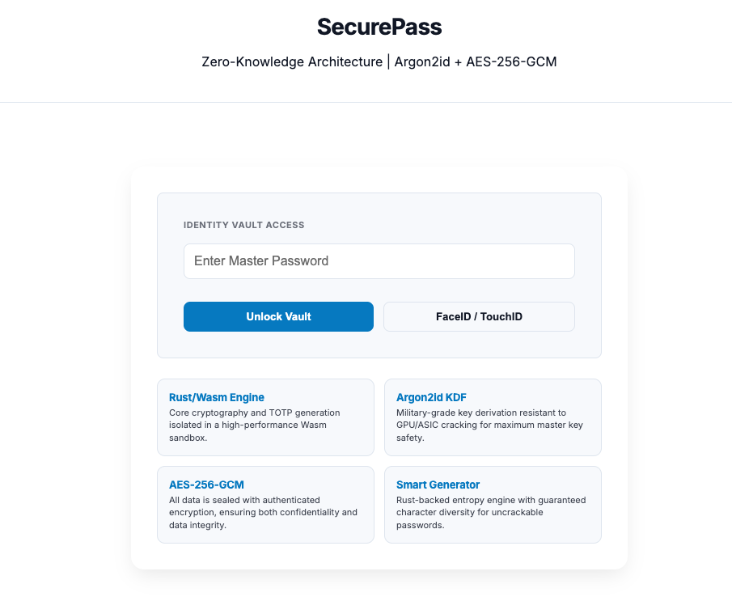
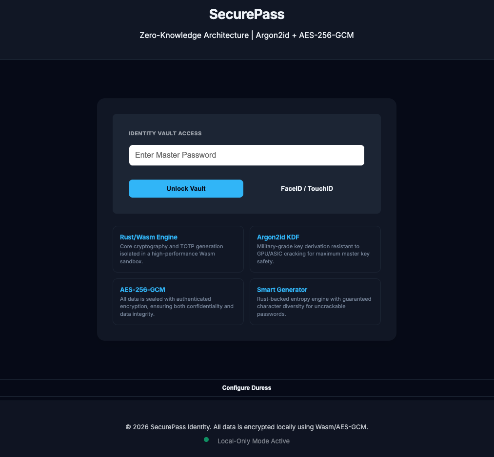

# 🔐 SecurePass: Zero-Knowledge Password Manager

SecurePass is a next-generation, rust-wasm-typescript-based web password manager engineered on a **Zero-Knowledge foundation**. It achieves elite performance and memory security by offloading all cryptographic heavy lifting to a **Rust-powered WebAssembly (Wasm) engine**, while utilizing TypeScript for a fluid and responsive user experience.

By isolating sensitive operations like Argon2id key derivation, AES-256-GCM encryption, and high-precision TOTP generation within the Wasm sandbox, SecurePass ensures that master keys never touch the JavaScript heap in plaintext. Beyond its hardened core, the platform offers a premium "Modern Sky" interface featuring biometric passkey unlocking, a stealthy Duress Mode decoy vault, a smart entropy engine with guaranteed character diversity, and a real-time security dashboard for comprehensive vault health monitoring.

---

## 📸 Overview

<p align="center">
   
  
</p>

---

## 📊 Project Metrics

| Metric | Value |
|--------|-------|
| **TypeScript Code** | ~3,696 lines |
| **Rust Code** | 391 lines |
| **Total Tests** | 60 (100% passing) |
| **Test Suites** | 5 files |
| **Components** | 13 Web Components |
| **Security Features** | 8 major features |

---

## ✨ Key Features

*   **💎 Modern Sky UI**: A professional, high-end minimalist interface optimized for light and dark modes.
*   **🛡️ Zero-Knowledge**: Your master password never leaves your device.
*   **☝️ Biometric Unlock**: Modern Passkey support (WebAuthn). Cryptographic wrapping is handled in **Rust/Wasm** for maximum memory safety.
*   **🎭 Duress Mode**: A "Panic Password" unlocks a fake decoy vault if you are forced to open it.
*   **🔐 Built-in 2FA (Wasm)**: Generate high-precision TOTP codes directly in the vault using a Rust-Wasm engine.
*   **🎲 Smart Generator**: High-entropy password generation that **guarantees** character diversity (Upper, Lower, Number, Symbol).
*   **📥 Backup & Restore**: Export encrypted JSON backups to keep your data safe.
*   **📊 Security Dashboard**: Real-time vault health analytics and breach detection powered by Wasm.
*   **📝 Encrypted Notes**: Store private metadata securely alongside your passwords.
*   **🔍 Breach Detection**: Real-time privacy-preserving checks against compromised databases.

---

## 🚀 Getting Started

### Prerequisites

Before you begin, ensure you have the following installed:
*   **Node.js** (v18+) & **npm**
*   **Rust** (Latest Stable): [Install Rust](https://www.rust-lang.org/tools/install)
*   **wasm-pack**: [Install wasm-pack](https://rustwasm.github.io/wasm-pack/installer/)

### Installation

1.  **Clone the repository**:
    ```bash
    git clone git@github.com:zonepearl/keepassman.git
    cd keepassman
    ```
2.  **Install dependencies**:
    ```bash
    npm install
    ```
3.  **Run development server**:
    ```bash
    npm run dev
    ```
4.  **Build for production**:
    ```bash
    npm run build
    ```

---

## 📖 User Guide

### 1. Initial Setup
*   Create a strong **Master Password** (Min 12 chars).
*   This password is the *only* way to decrypt your data. **Do not lose it.**

### 2. Enabling Biometrics (Passkeys)
*   Go to **Security Hub** (Sidebar footer or Toolbar).
*   Click **Link Biometrics**.
*   Verify with your device (TouchID/FaceID).
*   *Note: Taking this action allows you to unlock the vault without typing your password each time.*

### 3. Setting Up Duress Mode
*   Go to **Configure Duress** in the sidebar.
*   Set a **Panic Password** (different from your Master Password).
*   **How to use**: If someone forces you to unlock your vault, type the *Panic Password* at the login screen. It will stealthily unlock a fake vault with dummy data.

### 4. Backup & Restore
*   **Backup**: Click the **Exit/Export** button -> **Export Backup**. Safe to store anywhere (it's encrypted).
*   **Restore**: on the Login/Setup screen, click **Restore from Backup** and select your JSON file.

---

## 🏗️ Architecture Deep Dive

### Two-Tier Hybrid Architecture

SecurePass follows a **Logic-vs-Orchestration** model across two distinct runtime tiers:

#### **Tier 1: Logic Layer (Rust/Wasm)**
**Location**: `src-wasm/src/lib.rs`

**Purpose**: Cryptographic "Trust Anchor" - all sensitive operations isolated in WebAssembly

**Core Components**:
- `CryptoBridge` struct - Main cryptographic engine
- **Argon2id** key derivation (memory-hard, GPU-resistant)
- **AES-256-GCM** authenticated encryption
- **TOTP/2FA** generation using `totp-rs`
- **Zeroize** pattern for memory security (wipes keys on drop)
- Biometric key wrapping/unwrapping

**Key Functions**:
1. `new()` - Master key derivation from password + salt
2. `encrypt()/decrypt()` - AES-256-GCM operations
3. `generate_password()` - High-entropy password generation with guaranteed character diversity
4. `generate_mac_password()` - Mac OS style (xxx-xxx-xxx)
5. `generate_passphrase()` - Word-based memorable passwords
6. `get_totp_code()` - Time-based one-time password generation
7. `rotate_history()` - Password history management (last 5)
8. `derive_bio_key()` - Biometric credential key derivation
9. `wrap_password()/unwrap_password()` - Master password encryption for biometric unlock

#### **Tier 2: Orchestration Layer (TypeScript)**
**Location**: `src/`

**Purpose**: State management, UI coordination, persistence, hardware integration

**Key Services**:
- `WasmCryptoService` - Wrapper for Wasm bridge
- `VaultUnlockService` - Authentication flow with duress mode fallback
- `AutoLockService` - Inactivity-based auto-lock
- `BiometricService` - WebAuthn/Passkey integration
- `VaultState` - Singleton reactive state container
- `SecurityScanner` - XSS prevention, input sanitization, Base32 validation

**Web Components** (13 total):
1. `<vault-table>` - Data grid with filtering
2. `<vault-sidebar>` - Category navigation
3. `<vault-toolbar>` - Action bar with search
4. `<entry-modal>` - Entry editor with generator
5. `<security-dashboard>` - Vault health analytics
6. `<setup-wizard>` - Initial vault creation
7. `<biometric-auth>` - Passkey enrollment
8. `<duress-mode>` - Decoy vault setup
9. `<theme-toggle>` - Light/dark switcher
10. `<toast-notification>` - User feedback
11. `<status-indicator>` - Connection status

---

## 🔐 Security Features Analysis

### 1. **Zero-Knowledge Architecture** ✅
- Master password **never** sent to server
- All encryption/decryption happens in browser
- Argon2id ensures GPU/ASIC resistance
- AES-256-GCM provides authenticated encryption

### 2. **Memory Security** ✅
- Rust `Zeroize` trait physically wipes keys from RAM when `CryptoBridge` is dropped
- Master keys isolated in Wasm linear memory (not accessible to JS heap)
- Prevents memory scraping attacks

### 3. **Biometric Unlock (WebAuthn)** ✅
- Uses platform authenticators (FaceID/TouchID)
- Master password encrypted with biometric-derived key
- Key derivation: `Argon2id(credentialId) → bioKey`
- Wrapping: `AES-GCM(masterPassword, bioKey) → localStorage`

### 4. **Duress Mode (Decoy Vault)** ✅
- Separate "panic password" unlocks fake vault
- Fallthrough mechanism: tries primary → decoy
- All saves redirect to `decoy_vault` localStorage slot when active
- Stealthy operation with visual indicator

### 5. **Password History Tracking** ✅
- Last 5 passwords tracked per entry
- Managed in Rust for memory safety
- Automatic rotation on password updates

### 6. **TOTP/2FA Integration** ✅
- Native TOTP generation in Wasm (no external dependencies)
- RFC 6238 compliant (SHA1, 6 digits, 30s window)
- Base32 secret validation

### 7. **Auto-Lock Service** ✅
- Configurable timeout (1/5/15/30/60 min, never)
- Resets on: mousemove, keydown, click, touchstart
- Hard reload on timeout (clears state)

### 8. **XSS Prevention** ✅
Comprehensive scanning:
- Script tag detection
- Event handler injection (onclick, onerror, etc.)
- JavaScript protocol URLs
- Data URI schemes
- SVG/iframe injection
- CSS expression() attacks
- HTML entity encoding attempts

---

## 🎨 Advanced Password Generator

Three generation strategies:

| Strategy | Example Result | Use Case |
|----------|----------------|----------|
| **Standard** | `z8$K!mP9Q#2v` | High randomness, max security |
| **Mac OS Style** | `abc12x-def45y-ghi78z` | Human-readable, easy to type |
| **Passphrase** | `azure-tiger-vivid-pearl` | Memorable, high entropy |

**Guaranteed Character Diversity**: The standard generator ensures at least one character from each enabled character set (uppercase, lowercase, numbers, symbols) is included and shuffled randomly.

---

## 🗂️ Data Schema

### Vault Entry Structure
```typescript
{
  id: string;           // UUID v4
  title: string;        // Service name (XSS-sanitized)
  username?: string;    // Optional identity
  password: string;     // Encrypted secret
  category: string;     // all|work|personal|finance|social|other
  totpSecret?: string;  // Base32 2FA key
  favorite?: boolean;   // Star flag
  history?: string[];   // Last 5 passwords
  notes?: string;       // Encrypted metadata
}
```

### LocalStorage Schema
| Key | Content | Encryption |
|-----|---------|------------|
| `encrypted_vault` | Main vault JSON | AES-256-GCM |
| `decoy_vault` | Decoy vault JSON | AES-256-GCM |
| `vault_salt` | 256-bit salt | Plaintext |
| `bio_wrapped_password` | Master password | AES-256-GCM (bioKey) |
| `bio_iv` | Biometric IV | Plaintext |
| `bio_credential_id` | Passkey ID | Plaintext |

---

## 🧪 Testing & Quality

### Test Coverage (60 tests, 100% pass rate)

| Test Suite | Tests | Coverage |
|------------|-------|----------|
| `crypto.test.ts` | 21 | Encryption, key derivation, TOTP, biometric wrapping |
| `password.test.ts` | 18 | Generator diversity, entropy calculation |
| `VaultState.test.ts` | 11 | State management, filtering, history |
| `AutoLockService.test.ts` | 6 | Timer logic, activity tracking |
| `VaultUnlockService.test.ts` | 4 | Authentication flow, duress fallback |

**Rust Unit Tests**: 8 tests covering core cryptographic operations

### Running Tests
```bash
npm test          # Launch watch mode
npm run test:run  # Single run
npm run coverage  # Generate coverage report
```

---

## 📦 Build & Deployment

### Build Pipeline
```bash
npm run build
├─ Wasm: wasm-pack build src-wasm → src/pkg
├─ TS: tsc (type checking)
└─ Vite: bundling + terser minification
```

### Production Optimizations
- **Terser minification** (toplevel mangling)
- **Console.log removal**
- **Debugger statement removal**
- **Comment stripping**
- **Content-based hashing** for cache busting
- **No sourcemaps** (prevents reverse engineering)

### Wasm Compilation
- Target: `wasm32-unknown-unknown`
- Optimization: `-Oz` (size-optimized)
- LTO: enabled
- Panic: abort mode (reduces binary size)

---

## 📦 Tech Stack

*   **Languages**: TypeScript, Rust
*   **Architecture**: Wasm Cryptographic Bridge (Isolated Logic Tier)
*   **Bundler**: Vite
*   **Crypto**: Argon2id (KDF), AES-256-GCM (Cipher), totp-rs
*   **Tooling**: wasm-pack, wasm-bindgen
*   **Tests**: Vitest, Rust `#[test]`
*   **Styles**: Modern CSS / Glassmorphism (Light/Dark Mode)
*   **Fonts**: Inter, JetBrains Mono

---

## ⚠️ Security Considerations

### Strengths
✅ Zero-knowledge architecture
✅ Memory-safe cryptography (Rust)
✅ Authenticated encryption (AES-GCM)
✅ Memory wiping (Zeroize)
✅ XSS prevention
✅ CSP headers (implicit from static hosting)
✅ Comprehensive input validation

### Frontend Limitations
⚠️ **XSS Risk**: If compromised, malicious script could access `localStorage`
   - **Mitigation**: SecurityScanner + CSP

⚠️ **Physical Access**: Browser DevTools can inspect localStorage
   - **Mitigation**: All data encrypted with master password

⚠️ **No Server-Side Sync**: localStorage-only (no cross-device sync)
   - **Trade-off**: Perfect for privacy, inconvenient for portability

---

## 🎯 Industry Comparison

| Feature | SecurePass | Bitwarden | 1Password | KeePassXC |
|---------|------------|-----------|-----------|-----------|
| Zero-Knowledge | ✅ | ✅ | ✅ | ✅ |
| Browser-Based | ✅ | ✅ | ❌ | ❌ |
| Wasm Crypto | ✅ | ❌ | ❌ | ❌ |
| Biometric Unlock | ✅ | ✅ | ✅ | ❌ |
| Duress Mode | ✅ | ❌ | ❌ | ❌ |
| TOTP Built-in | ✅ | ✅ | ✅ | ✅ |
| Cross-Device Sync | ❌ | ✅ | ✅ | Manual |

**Key Differentiators**:
1. **Wasm-isolated cryptography** - Industry-leading memory security
2. **Duress mode** - Unique anti-coercion feature
3. **Zero dependencies** for crypto - Everything built from Rust crates
4. **Modern architecture** - Web Components + reactive state

---

## 📈 Future Roadmap

### High Priority
- [ ] **File System Access API** - Sync to local `.spvault` file instead of localStorage
- [ ] **Export/Import Improvements** - Better backup UX
- [ ] **Custom Fields** - Arbitrary metadata per entry

### Advanced Features
- [ ] **Hardware Keys** - YubiKey/FIDO2 support
- [ ] **Breach Scanning (Offline)** - Local HIBP database
- [ ] **Browser Extension** - Auto-fill integration
- [ ] **Mobile PWA** - Installable progressive web app
- [ ] **E2E Cloud Sync** - Optional encrypted backup to cloud

---

## 📖 Developer & Technical Documentation

For detailed architecture, security models, cryptographic specifications, and testing protocols, please refer to:

👉 **[DEVELOPER_MANUAL.md](./DEVELOPER_MANUAL.md)** — Includes a **[Rust-to-Wasm Journey](./DEVELOPER_MANUAL.md#️-the-journey-from-rust-to-typescript)** guide for beginners! 🦀
👉 **[src-wasm/README.md](./src-wasm/README.md)** — Logic Tier Architecture & Sequence Diagrams.

---

## 🏁 Project Status

**Maturity Level**: Beta/Production-Ready for personal use
**Security Posture**: Strong (suitable for sensitive data)
**Code Quality**: High (well-tested, documented, typed)

### Recent Development Trajectory
1. **UI Modernization** - Transitioned to "Modern Sky" design system
2. **Component Extraction** - Refactored monolithic code to Web Components
3. **Wasm Integration v2.0** - Enhanced cryptographic bridge
4. **Advanced Generator** - Added Mac/Passphrase modes
5. **Testing Suite** - Achieved 60+ tests with 100% pass rate

---

## 🎓 Code Quality

### Assessment
- ✅ Clean separation of concerns (Logic vs Orchestration)
- ✅ Comprehensive documentation
- ✅ Type-safe TypeScript
- ✅ Memory-safe Rust
- ✅ 100% test pass rate
- ✅ Modern build tooling

### Recommendations
- Add E2E tests (Playwright/Cypress)
- Implement code coverage reporting
- Add performance benchmarks
- Third-party security audit

---

## 📄 License

MIT License - See [LICENSE](LICENSE) file for details.

---

## 🤝 Contributing

Contributions are welcome! Please feel free to submit a Pull Request. For major changes, please open an issue first to discuss what you would like to change.

---

**Built with ❤️ using Rust, WebAssembly, and TypeScript**

*SecurePass: Where memory safety meets zero-knowledge security.*
