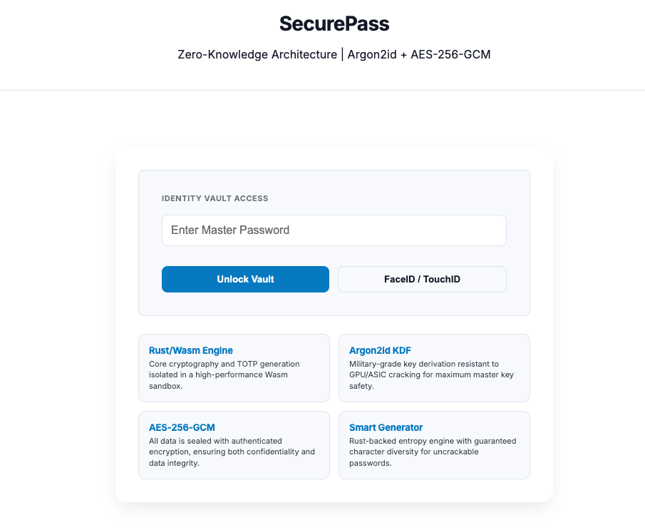
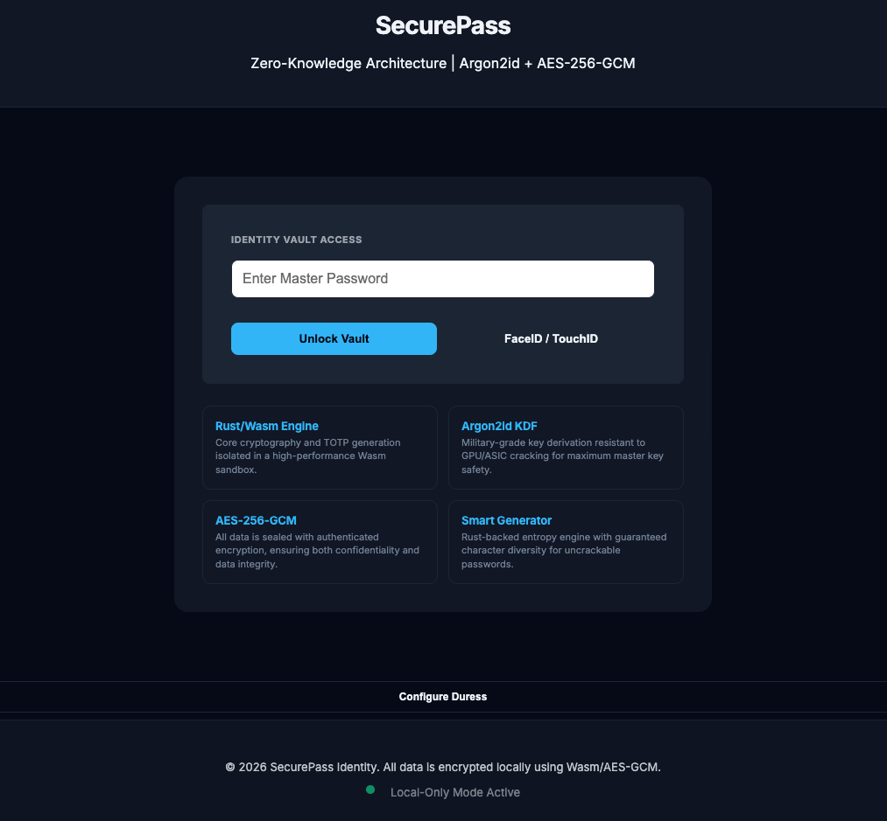

# SecurePass

A browser-based password manager. Cryptographic work — key derivation, encryption, TOTP — runs in Rust compiled to WebAssembly. The TypeScript layer handles the UI and browser APIs. Everything is encrypted on-device; the master password never leaves the browser.

**Version:** 2.1.0 | **Status:** Personal use / beta

---

## Screenshots

<p align="center">
  
  
</p>

---

## Architecture

SecurePass separates concerns across two runtime layers:

**Logic layer — `src-wasm/src/lib.rs` (Rust → Wasm)**

All cryptographic operations are confined to a Rust module compiled to WebAssembly. The master key lives only in Wasm linear memory — it is never passed to the JavaScript heap as a string or object. The `CryptoBridge` struct zeroes its key on `drop()` via the `Zeroize` trait.

- Key derivation: Argon2id (`argon2` crate)
- Encryption / decryption: AES-256-GCM (`aes-gcm` crate)
- TOTP generation: RFC 6238 (`totp-rs` crate)
- Password generation: hardware-backed CSPRNG (`rand` crate)
- Biometric key wrapping: Argon2id(credentialId) → AES-GCM(masterPassword)
- Memory cleanup: `ZeroizeOnDrop` on all key material

**Orchestration layer — `src/` (TypeScript)**

Handles everything outside cryptography: persisting encrypted blobs to `localStorage`, managing application state, rendering Web Components, coordinating the WebAuthn flow, and the inactivity auto-lock timer.

- `WasmCryptoService` — typed wrapper around the Wasm module
- `VaultUnlockService` — authentication with duress-mode fallthrough
- `BiometricService` — WebAuthn credential create / get
- `AutoLockService` — inactivity timeout, resets on user input events
- `VaultState` — singleton reactive state with pub/sub listeners
- `SecurityScanner` — input sanitisation, XSS pattern detection

**Component model:** 13 native Web Components (no framework). Components communicate via `CustomEvent` bubbling; `main.ts` listens at the document level and updates `VaultState`.

---

## Security Model

### Zero-knowledge

No master password or derived key is ever transmitted off-device. There is no backend. Encryption and decryption happen entirely in the browser. The only outbound request is an opt-in breach check to `api.pwnedpasswords.com` using a k-anonymity SHA-1 prefix (the first 5 hex characters of the hash — the full hash is never sent).

### Key derivation

Argon2id is used for all key derivation. The parameters are tuned to be memory-hard, making offline GPU/ASIC brute-force attacks substantially more expensive than with iteration-only KDFs. A separate 256-bit random salt is generated per vault and stored in `localStorage` unencrypted (salts are not secret; their randomness is what matters).

### Authenticated encryption

AES-256-GCM produces a 16-byte authentication tag over the ciphertext. Any modification to stored data causes decryption to fail with an error — it will not return corrupt plaintext. A fresh random 12-byte IV is generated for every encryption call.

### Biometric unlock

WebAuthn is used to prove device presence, not for standard relying-party authentication. The `credentialId` returned by `navigator.credentials.get()` is fed into Argon2id to derive a deterministic wrapping key. The master password is AES-GCM-encrypted with that key and stored in `localStorage`. Biometric unlock: `WebAuthn assertion → credentialId → Argon2id → bioKey → AES-GCM decrypt → masterPassword → normal vault unlock`.

### Duress mode

A second AES-GCM-encrypted vault (`decoy_vault`) is maintained alongside the real vault, derived from a separate Argon2id salt. `VaultUnlockService` first attempts to decrypt the real vault; if that fails, it attempts the decoy vault. A successful decoy unlock sets `isDecoyMode = true` and redirects all subsequent writes to `decoy_vault`. The two unlock paths are indistinguishable from the outside.

### Content Security Policy

```
default-src 'self';
script-src 'self' 'wasm-unsafe-eval';
style-src 'self' 'unsafe-inline' https://fonts.googleapis.com;
font-src 'self' https://fonts.gstatic.com;
connect-src 'self' https://api.pwnedpasswords.com;
img-src 'self' data:;
base-uri 'self';
form-action 'self';
frame-ancestors 'none';
```

`'wasm-unsafe-eval'` is required for `WebAssembly.instantiate()`. `frame-ancestors 'none'` must be delivered as an HTTP header — it has no effect in a `<meta>` tag. See [DEVELOPER_MANUAL.md](./DEVELOPER_MANUAL.md#-security-headers-deployment-guide) for server configuration files (Vercel, Netlify, Apache, Nginx).

### Known limitations

- **XSS**: A successful XSS attack on the running page can access `localStorage`. Mitigation: `SecurityScanner` rejects script tags and event-handler injection patterns; CSP blocks inline scripts. This is an inherent constraint of browser-based apps.
- **Physical access**: `localStorage` data is encrypted, but the browser storage files on disk are accessible to anyone with OS-level access to the machine.
- **No cross-device sync**: All data is stored locally. There is no mechanism to synchronise across browsers or devices in the current version.
- **Wasm memory is readable**: JS can access Wasm linear memory via `wasmInstance.exports.memory.buffer`. The key never crosses the boundary as a JS value, but the Wasm memory itself is not fully opaque. `Zeroize` minimises the window, but a memory dump taken while the vault is unlocked could capture key material.

---

## Data Schema

### Vault entry

```typescript
interface VaultEntry {
  id: string;           // UUID v4
  title: string;        // XSS-sanitised service name
  username?: string;
  password: string;     // Plaintext in memory only; encrypted at rest
  category: string;     // work | personal | finance | social | other
  totpSecret?: string;  // Base32-encoded 2FA secret
  favorite?: boolean;
  history?: string[];   // Last 5 previous passwords
  notes?: string;       // Encrypted metadata
}
```

### localStorage slots

| Key | Contents | At rest |
|-----|----------|---------|
| `encrypted_vault` | Main vault JSON (`VaultEntry[]`) | AES-256-GCM |
| `decoy_vault` | Decoy vault JSON | AES-256-GCM |
| `vault_salt` | 256-bit KDF salt | Plaintext |
| `decoy_salt` | 256-bit KDF salt for decoy | Plaintext |
| `bio_credential_id` | WebAuthn credential ID | Plaintext (base64) |
| `bio_wrapped_password` | Master password encrypted with biometric key | AES-256-GCM |
| `bio_iv` | IV for biometric wrapping | Plaintext |

Encrypted values are stored as `{ iv: number[], data: number[] }` — the `data` field contains ciphertext with the 16-byte GCM auth tag appended.

---

## Getting Started

### Prerequisites

- **Node.js** v18+ and npm
- **Rust** (stable) — [rustup.rs](https://rustup.rs/)
- **wasm-pack** — [rustwasm.github.io/wasm-pack](https://rustwasm.github.io/wasm-pack/installer/)

### Setup

```bash
git clone <repository-url>
cd securepass
npm install
npm run build:wasm   # compile Rust → Wasm (one-time; re-run after any lib.rs change)
npm run dev          # start Vite dev server at http://localhost:5173
```

### Commands

```bash
npm run dev          # development server with HMR
npm run build        # build:wasm + tsc + vite build → dist/
npm run test         # Vitest in watch mode
npm run test:run     # single test run
npm run coverage     # coverage report via v8
```

When modifying Rust code, rebuild the Wasm module before restarting the dev server:

```bash
npm run build:wasm
npm run dev
```

For Rust-only testing:

```bash
cd src-wasm && cargo test
```

---

## Build Pipeline

```
npm run build
├── wasm-pack build src-wasm --target web --out-dir ../src/pkg
│   └── produces: securepass_wasm.wasm + securepass_wasm.js + .d.ts
├── tsc --noEmit   (type checking only)
└── vite build
    └── Terser minification
        ├── drop_console: true
        ├── drop_debugger: true
        ├── toplevel: true (top-level name mangling)
        └── no sourcemaps
```

Wasm compilation flags (`Cargo.toml [profile.release]`):

```toml
opt-level = "z"      # size-optimised
lto = true           # link-time optimisation
codegen-units = 1    # required for LTO
panic = "abort"      # removes panic unwind machinery
```

Sourcemaps are intentionally disabled in production. Console output is stripped by Terser — this also removes any accidental logging of sensitive values.

---

## Testing

70+ tests across 5 TypeScript suites and 8 Rust unit tests.

| Suite | Tests | What is covered |
|-------|-------|----------------|
| `crypto.test.ts` | 21 | AES-GCM encrypt/decrypt, Argon2id key derivation, TOTP, biometric key wrapping |
| `password.test.ts` | 18 | Generator output diversity, entropy calculation |
| `VaultState.test.ts` | 11 | State mutations, filtering, password history rotation |
| `AutoLockService.test.ts` | 6 | Timer logic, activity event handling |
| `VaultUnlockService.test.ts` | 4 | Normal unlock, duress fallthrough |

All crypto tests call `WasmCryptoService.init()` in `beforeAll()` — the Wasm module must be initialised before any test that calls into it.

---

## Tech Stack

| Layer | Technology |
|-------|-----------|
| Language (crypto) | Rust (stable) |
| Language (UI) | TypeScript 5.9.3 |
| Wasm toolchain | wasm-pack, wasm-bindgen 0.2.92 |
| Bundler | Vite 7.3.1 |
| Test runner | Vitest 4.0.16, happy-dom |
| KDF | argon2 0.5.3 (Argon2id variant) |
| Cipher | aes-gcm 0.10.3 (AES-256-GCM) |
| TOTP | totp-rs 5.6.0 |
| Randomness | rand 0.8.5 (OS entropy) |
| Serialisation | serde 1.0 + serde-wasm-bindgen 0.6.5 |
| Memory safety | zeroize 1.8.1 (ZeroizeOnDrop) |

---

## Roadmap

Items are listed by functional area, not priority ranking.

**Browser extension**
- Auto-fill `<input type="password">` fields in content scripts
- Background service worker holds the decrypted `CryptoBridge`
- Secure message passing between popup, background, and content scripts
- Chrome, Firefox (and Safari / Edge as secondary targets)

**Cross-device sync**
- Phase 1: File System Access API — read/write a local `.spvault` file
- Phase 2: User-supplied cloud storage (Dropbox, Google Drive) with client-side encryption before upload
- Phase 3: Self-hosted relay (Docker) — stores only ciphertext

**Import**
- Bitwarden JSON, 1Password `.1pux`, LastPass CSV, Chrome/Firefox CSV export

**Additional auth factors**
- YubiKey / FIDO2 hardware key as second factor (then as primary in a later phase)
- Emergency access: printable recovery codes; trusted-contact delegation with configurable wait period

**Vault features**
- Custom fields per entry (text, hidden, date, URL)
- File attachments (IndexedDB local; encrypted cloud in later phase)
- Secure sharing via encrypted URL fragment with expiration

**Tooling**
- PWA manifest for installable offline use
- CLI for vault management and CI/CD integration
- Automated breach scan on vault unlock (vs current on-demand)
- Offline HIBP bloom filter (~500 MB local database)

---

## Developer Documentation

- [DEVELOPER_MANUAL.md](./DEVELOPER_MANUAL.md) — architecture walkthrough, Rust/Wasm bridge, testing strategy, security headers, changelog
- [ENGINEER_ROADMAP.md](./ENGINEER_ROADMAP.md) — full skill set reference: cryptography, Wasm, Rust, TypeScript, Web APIs, build tooling, recommended learning order
- [TODO.md](./TODO.md) — known gaps, security improvements, and backlog
- [src-wasm/README.md](./src-wasm/README.md) — Logic tier architecture and sequence diagrams

---

## Contributing

Open an issue before starting significant work so the approach can be discussed. Run `npm run test:run` and `npm run build` before submitting a pull request.

---

## License

MIT — see [LICENSE](LICENSE).
