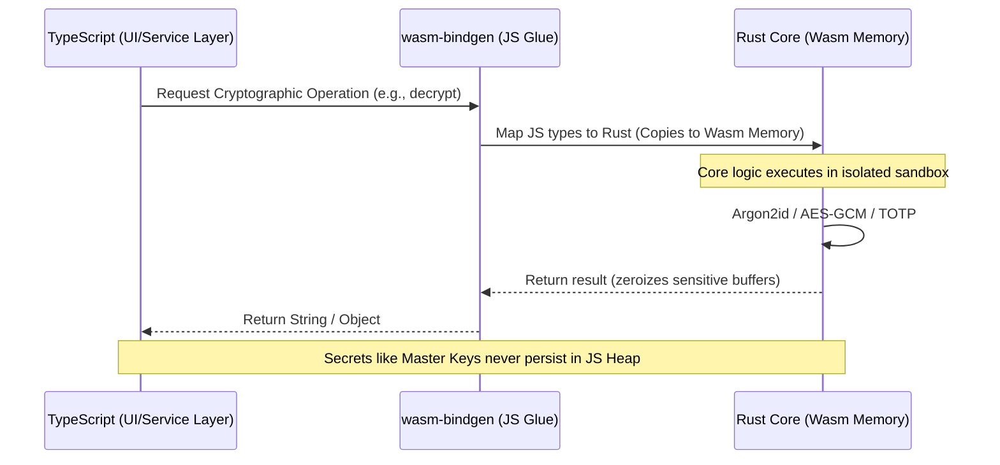

# 🦀 SecurePass Core: Rust + Wasm Cryptographic Bridge

This directory contains the high-security cryptographic logic for SecurePass, implemented in Rust and compiled to WebAssembly. By move sensitive operations into a Wasm sandbox, we achieve superior memory isolation and performance compared to standard JavaScript implementations.

## 🏗️ Architecture: The "Trust Anchor" Bridge

The Wasm module acts as a "Trust Anchor" for the application. While TypeScript manages the UI and application flow, the Wasm bridge handles all sensitive cryptographic and generation logic.

### Interaction Diagram



## 🛡️ Design Approach

Our architecture follows four core security principles:

### 1. Zero-Knowledge Architecture
SecurePass is designed so that the server (and even the main JS thread where possible) never has access to the user's master password or unencrypted vault keys. All encryption happens locally within the Wasm sandbox.

### 2. Memory Isolation (Logic Tier Separation)
By offloading cryptography to Wasm, we limit the exposure of sensitive data (like the derived Master Key) to the JavaScript heap. Wasm's linear memory is isolated, making it significantly harder for malicious scripts to "scrape" keys from memory.

### 3. High-Performance Cryptography
We leverage industrial-grade Rust crates for core operations:
- **Argon2id**: Memory-hard key derivation resistant to GPU/ASIC cracking.
- **AES-256-GCM**: Authenticated encryption ensuring both confidentiality and integrity.
- **Biometric Wrapping**: Uses Argon2id to derive device-specific wrapping keys from passkey credentials, ensuring master passwords never touch the JS heap in plaintext.
- **Guaranteed Entropy**: Password generation logic ensures at least one character from every requested set (Upper, Lower, Number, Symbol) is included.
- **totp-rs**: Precise and secure 2FA code generation.

### 4. Zero-Trust Logic Boundary
TypeScript only sends "opaque" data to the bridge and receives finalized results. The bridge itself maintains the cryptographic state, ensuring that the "Logic Tier" is the only place where raw keys exist.

## 🚀 Technical Stack

- **Language**: Rust (Stable)
- **Tooling**: `wasm-pack` for compilation and binding generation.
- **Bindings**: `wasm-bindgen` and `serde-wasm-bindgen` for high-speed JS/Rust communication.
- **Security Crates**: `argon2`, `aes-gcm`, `getrandom`, `zeroize`, `serde`.

## 🛠️ Build & Development

### Prerequisites
*   **Rust** (Latest Stable)
*   **Wasm-pack** toolchain (`npm install -g wasm-pack` or manual install)

To rebuild the Wasm module after changes:

```bash
npm run build:wasm
```

This command runs `wasm-pack` to compile the Rust code and generate the TypeScript definitions in `src/pkg/`.
